<!-- hero: monochrome ASCII portrait (types in) beside a neofetch-style info
     panel. regenerate portrait: python scripts/prep_photo.py <photo> &&
     python scripts/make_ascii_svg.py ; info panel: python scripts/make_info_card.py -->

<!-- animated contribution graph: real data, boxes reveal cell by cell
     (regenerated daily by .github/workflows/update-profile-art.yml) -->

<!-- Profile README -->

<h1><code>Hey 👋, I'm 0xh3x</code></h1>
<h3 align="center">🔐 Ethical Hacker | 🛡️ Penetration Tester | 🚀 Cybersecurity Enthusiast</h3>

  

<h3><code>0xh3x0x@github ~ $ ./contributions.sh</code></h3>

 
 

<h3><code>0xh3x0x@github ~ $ whoami</code></h3>

<table>
<tr>
<td valign="top"></td>
<td valign="top"></td>
</tr>
</table>

 
 

<h3><code>0xh3x0x@github ~ $ ./Tech-Stack.sh</code></h3>

  
   
  

 
 

<h3><code>0xh3x0x@github ~ $ ./links.sh</code></h3>

<b>Ethical Hacker · Offensive Security Professional · Cybersecurity Enthusiast</b>

 

